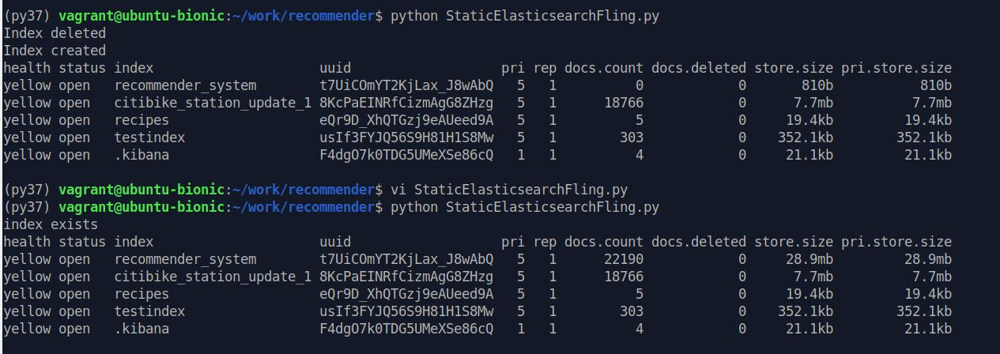
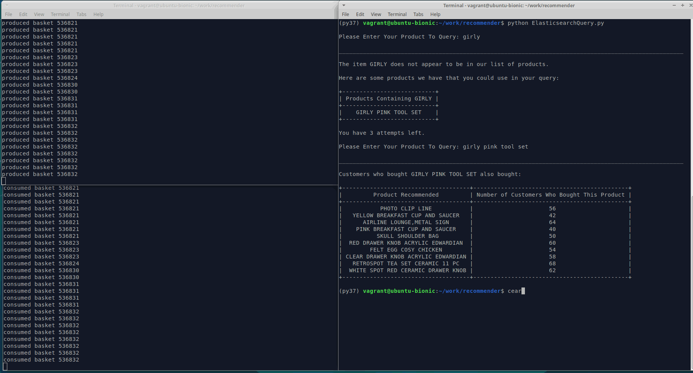
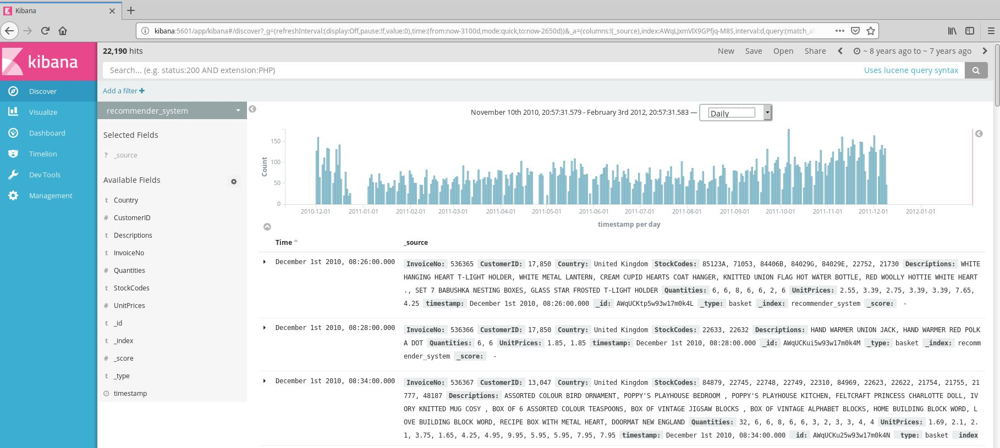

# Elasticsearch Recommender System for Online Purchases


## Synopsis

This repo contains a final project submitted for the course [Unstructured and Distributed Data Analysis and Modeling,](https://github.com/sstirlin/MSBX5420Spring2019) 
taught by Spencer Stirling, in partial fullfillment of the degree of Masters of Business Analytics at the University of Colorado - Boulder.

The inspiration is drawn from this article: [A recommender system for ingredients in recipes.](https://qbox.io/blog/building-simple-recommender-systems-for-elasticsearch-1) 

The project was fairly open-ended, requiring a Minimum Viable Product (MVP) to deliver in a few days which, given a product name, would recommend similar products 
much like Amazon's "Customers who bought this also bought..." recommendations. I based recommenations on products frequently purchased together and some statistical 
relevance of whether those products were of interest or too obvious a recommendation. 

To sum: build an Item-Item recommender (as opposed to a User-Item one) for a dynamic, streaming environment using Kafka producers and consumers and querying Elasticsearch. 

---

## The Dataset

Since current, streaming online purchase data is proprietary and unavailable and this is just a proof-of-concept project, we used old yet real online purchase data from 01/12/2010 to 09/12/2011

The dataset and a detailed description of it can be found and downloaded here at the [UCI Machine Learning Repository - Online Retail Data Set.](https://archive.ics.uci.edu/ml/datasets/online+retail#)

---

## Running the Recommender

There are four Python scripts in my project:

* KafkaProducer.py
* KafkaConsumer.py
* StaticElasticsearchFling.py
* QueryElasticsearch.py

The project can be run in two ways:

* dynamically (as intended)
* statically (since the data is old and this is possible, and faster)


Note that while this project mimics streaming services, for it to run, the dataset must be stored locally in the same folder as the scripts. 

This project also requires Elasticsearch and Kafka; I'm running a simple local cluster pulled from [Prof. Stirling's GitHub repo.](https://github.com/sstirlin/docker-elasticsearch)

### 1. Dynamically

*TL;DR - Run this version of the project if you have more time. This MVP is almost not viable in that the result is too slow at first; one needs to wait for the product list to fill up 
to get good recommenations.*


The Kafka producer and consumer simulate a more realistic scenario in that they produce a real-time stream of data. Since the consumer is slower, I had to slow down the producer 
using a 0.5 second wait time, which in computer terms is an eternity. (It is possible 0.5 secs was overkill, change it at will.) This prevents a `BufferError: Local: Queue full` error 
as the producer gets over 10,000 messages ahead of the consumer. 

**FIRST**, run the producer in one terminal, then run the consumer in another terminal. The commands should be simple:

```
# Terminal 1
python KafkaProducer.py 

# Terminal 2
python KafkaConsumer.py 

```

The **KafkaProducer.py** script reads data locally from the downloaded Excel file (producing a CSV file in the meantime). Since the rows are on a per-item aggregation level and we 
want a per-basket (a basket is a "shopping cart") aggregation to be able to see what people bought together, the script aggregates on a basket-level and produces a message for 
each basket to a Kafka topic.

The **KafkaConsumer.py** script consumes each message (basket) and flings it into an Elasticsearch index. This sounds harder than it looks, as it needs to specify a index configuration
to convert the data into Elasticsearch-friendly format, which is a nested structure similar to JSON. 

Both scripts print out the messages being produced and consumed to the console. This is unnecessary and slows down the process as well, yet it helps us visualize the stream and how 
it is synchronized. 

* NB - I commented out the `delete_index()` function on line 131 of the KafkaConsumer.py script since in a realistic implementation one would not delete the Elasticsearch index, this 
causes a duplication problem, however, it simplifies further lookups since it takes so long to fill up the products list.


**SECOND**, run the QueryElasticsearch.py script in a third terminal after a few minutes of producing-consuming:

```
# Terminal 3
python QueryElasticsearch.py
```

The **QueryElasticsearch.py** script runs the CLI interface for our recommender system. It asks for user input. Without any idea of what products are available, we can pass it words 
such as "chocolate" or "metal" to see what products are available that contain those words. We get a table of existing products and we can query again using a real product name. 

While there is some basic sanitization of input, product names must be passed exactly as displayed. The user has four attempts to get a product name correctly before being logged out 
of the system. 

Future versions of this project would cleanup the product names better so as to remove internal spaces and so forth.

* Technical Note: queries to Elasticsearch are done using the Lucene language, which is structured similarly to JSON and carries some smarts on how significant results are. More on this 
in the Results section below.


### 2. Statically 

While this version is slightly misguided (since we are supposed to mimic a dynamic process), it is easier to use. It runs much faster since we can fill up the entire products list 
in one go and query later. It also only prints out the current Elasticsearch indices to the console. 

**FIRST**, run the StaticElasticsearchFling.py script and wait for completion (anywhere from five to ten minutes perhaps):

```
python StaticElasticsearchFling.py
```


The **StaticElasticsearchFling.py** script reads data just as the KafkaProducer.py script did, but it bypasses the whole step of producing to a Kafka topic and just flings messages 
into Elasticsearch.


* NB - Notice that because we are filling up the Elasticsearch index once, we must first delete this index. This is not normal; comment out line 118 as needed but beware of data 
duplication.


Here's the output of StaticElasticsearchFling.py as it lists indices in Elasticsearch. Notice how I commented out deleting the index and ran this script again to show the recommender 
system index filled up with "documents" (see Note on Terminology below):


*Elasticsearch Indices*

 


**SECOND**, run the QueryElasticsearch.py script and follow the prompts as explained above:

```
python StaticElasticsearchFling.py
```

* Note on Terminology - We're interested in shopping carts or "baskets", each of these is a "row" in our aggregated data, which is produced-consumed as a separate "message" 
(Kafka terminology) and flung into Elasticsearch as a "document." There are 22,190 baskets, or messages, or documents.


---

## Results

One should be able to get a list of recommendations with similar products purchased by consumers (people who actually bought those items back in 2010-11) and a count of how many 
consumers bought those products. This will be printed out to the console using Python PrettyTables. Here is a demo of a dynamic run of the project using a Kafka Producer (top 
left) and Consumer (bottom left) and QueryElasticsearch.py on the right side:

*Demo*

 


**Counts vs Usefulness**

The table of recommenations is not displayed in descending order of counts since that is not the only metric Elasticsearch uses to rate how good a recommendation is. Using an 
"ingredients-in-a-recipe" analogy, since many recipes use basic ingredients such as flour, water, salt, or sugar, a recommender system using frequency alone would display as 
top recommendations these same ingredients. This would not be useful.

Thus, the recommenation is also based on a significance "score" computed by Elasticsearch and the setting "significant_terms" in the query made to Elasticsearch (see line 67 of 
QueryElasticsearch.py). Elasticsearch scoring and aggregation by significant_terms is a deep topic beyond the scope of this MVP, more can be read about it in the 
[Elasticsearch Documentation on Significant-Terms Aggregation.](https://www.elastic.co/guide/en/elasticsearch/reference/current/search-aggregations-bucket-significantterms-aggregation.html)
Basically, using 'significant_terms" we can get Elasticsearch to do the work for us and select the most significant results, so we can display them in a useful order. 

**Kibana and Visualizations**

This project could have used Kibana for visualizations. Kibana is hosted online and accessible at http://kibana:5601. A quick way to check whether Elasticsearch has data is to 
just visualize it as a timeline in Kibana if timestamps (dates) data is available.

*Kibana Timeline*

 

---

## Limitations and Future Implementations


- *Clean Product Names*: as mentioned, more cleanup of product names is warranted since a lot of products do not query well.


- *Kibana Visualizations*: future implementations might include Kibana visualizations.


- *Turn on Analyzer*: 

This turned out to be the hardest challenge of the project. Elasticsearch has various analyzers that help divide text (such as a long product description in our case) 
into terms on word boundaries. By default, Elasticsearch uses a `standard analyzer` (see [Elasticsearch Analyzers](https://www.elastic.co/guide/en/elasticsearch/reference/current/analysis-analyzers.html)). 
When I performed the aggregation to get to the basket-level, this analyzer caused problems (an HTTP status code 400: Bad Request Error) so I tured it off with `index: not_analyzed` 
in the Lucene query passed to Elasticsearch. The consequence is that the user has to know the exact product name to be able to query the system. The products list is huge 
so it wouldn't make sense to list all products.

Ideally, the solution would involve finding out why the standard analyzer didn't allow aggregation in the "Descriptions" field. I created a simplistic product-lookup that does not 
perform very well, at least in the dynamic implementation of this product. Perhaps after cleaning up product names better this workaround I made would work better (something to test), otherwise, a better 
solution should be implemented. 


---


Marcelo Sanches - Boulder, CO - May 7, 2019


